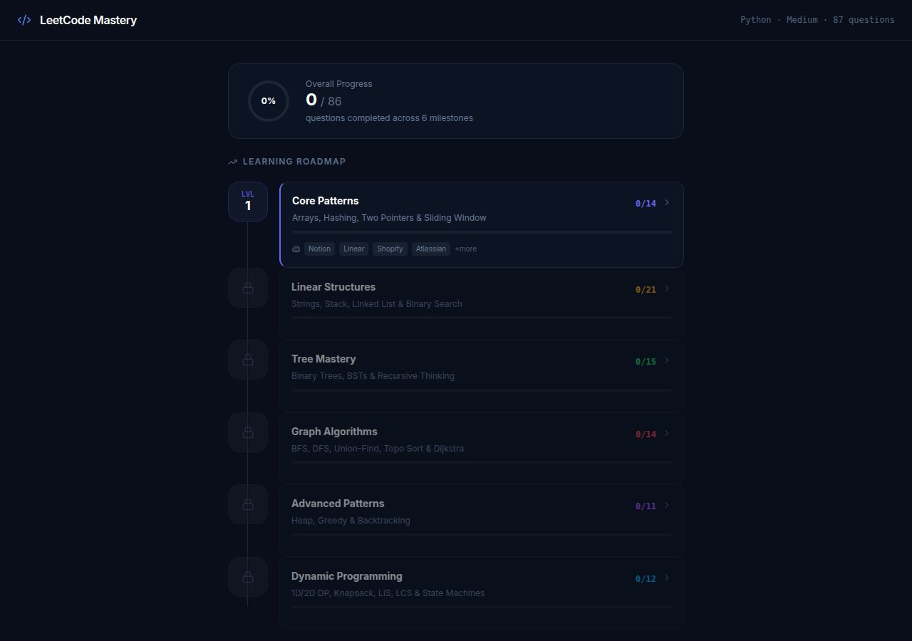
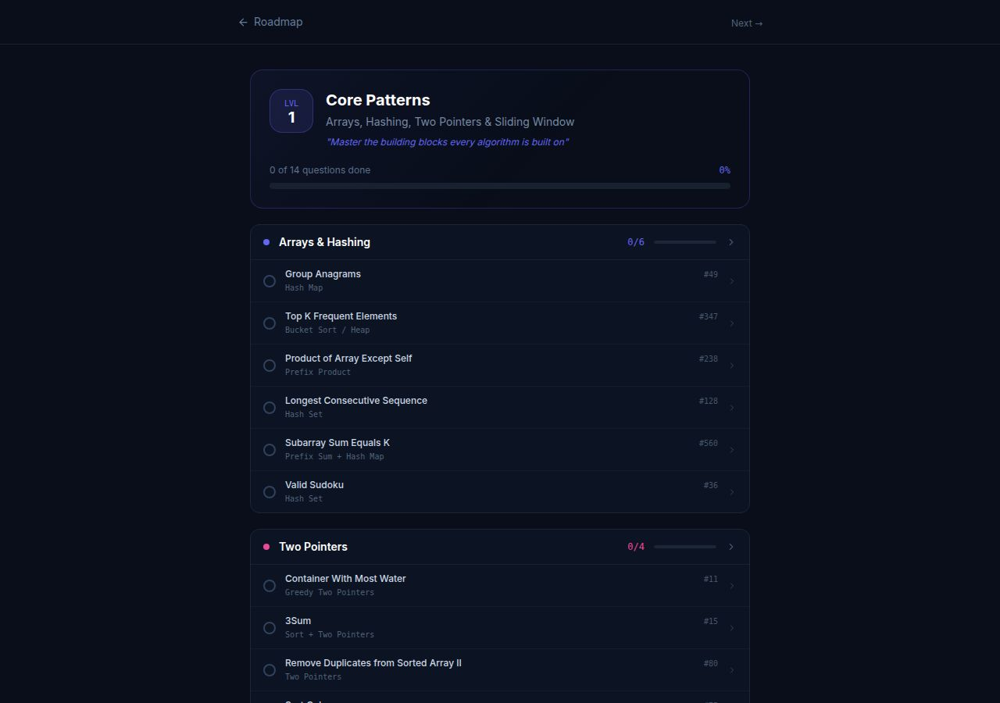
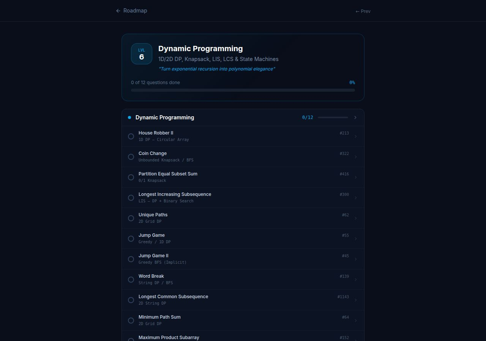
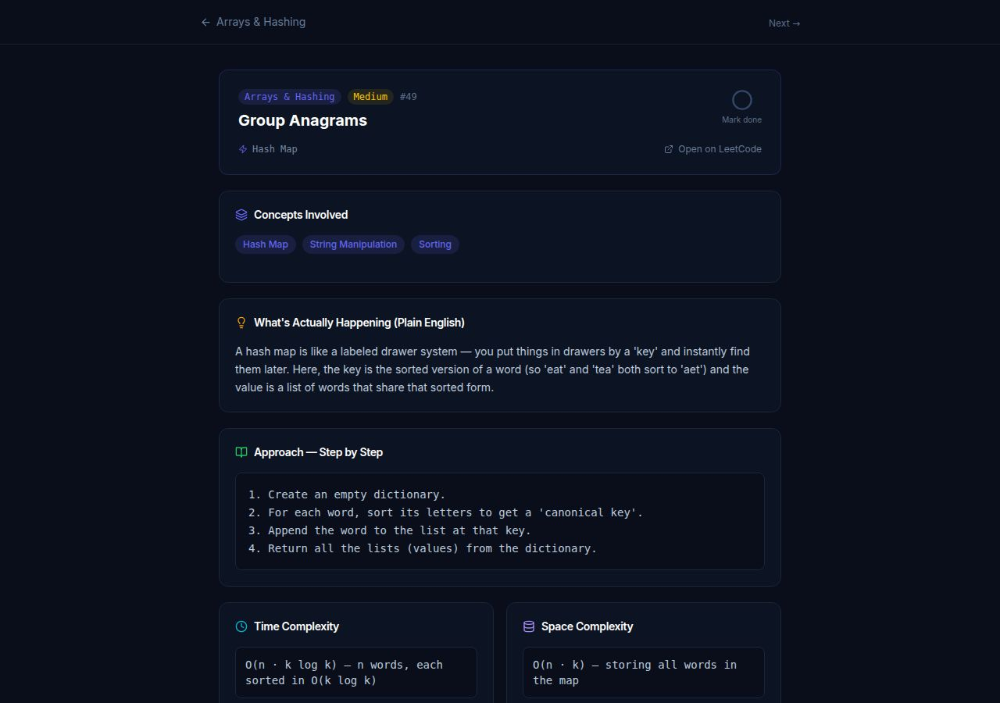
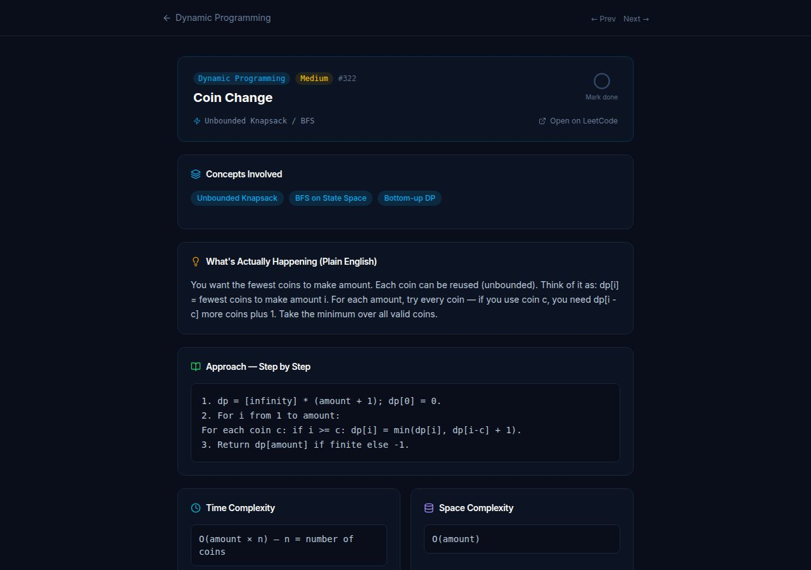

# LeetCode Mastery Tracker

> A structured 6-milestone learning roadmap for Python interview preparation — 87 curated Medium questions with plain-English explanations, step-by-step approaches, complexity analysis, company signals, and progress tracking built in.


---

## What It Is

Most LeetCode prep resources dump 300+ problems at you with no sequence, no explanation of *why* patterns work, and no sense of what level of readiness you've actually reached. This app fixes that.

**LeetCode Mastery Tracker** is a focused, opinionated roadmap: 87 carefully chosen Medium-difficulty questions organized across 6 progressive milestones. Each question teaches a reusable pattern. Each milestone unlocks the next. Every question comes with a plain-English breakdown so you understand the concept — not just the code.

---

## Screenshots

### The Learning Roadmap — Your Home Base

Six milestones, sequentially locked. Company hiring signals per milestone. Overall progress at a glance.



---

### Milestone Detail — Questions Organized by Pattern

Each milestone groups questions by category, shows per-category progress bars, and lists which skills you'll master.



---

### Milestone 6 — Dynamic Programming

The final milestone. 12 questions covering every core DP family: 1D/2D, knapsack, LIS, LCS, string DP, and state machines.



---

### Question Detail — Plain English + Step-by-Step Approach

Every question has: concept tags, a layman explanation of what's actually happening, a numbered algorithmic approach, time/space complexity, and related patterns to reinforce learning.



---

### DP Question — Coin Change

The same rich detail applied to a Dynamic Programming question: concepts, plain-English intuition, exact approach, complexity.



---

## The 6-Milestone Roadmap

| Level | Milestone | Categories | Questions | Confidence Tier |
|-------|-----------|------------|-----------|-----------------|
| 1 | **Core Patterns** | Arrays & Hashing, Two Pointers, Sliding Window | 14 | Building |
| 2 | **Linear Structures** | Strings, Stack, Linked List, Binary Search | 21 | Solid |
| 3 | **Tree Mastery** | Binary Trees, BSTs, Recursive Thinking | 15 | Solid |
| 4 | **Graph Algorithms** | BFS, DFS, Union-Find, Topo Sort, Dijkstra | 14 | Strong |
| 5 | **Advanced Patterns** | Heap, Greedy, Backtracking | 11 | Strong |
| 6 | **Dynamic Programming** | 1D/2D DP, Knapsack, LIS, LCS, State Machines | 12 | Elite |

Milestones are locked sequentially — you unlock the next by completing the current one.

---

## What Each Question Includes

- **Concept tags** — the data structures and techniques used
- **Plain-English explanation** — what's actually happening, no jargon
- **Step-by-step approach** — numbered algorithmic walkthrough, Python-idiomatic
- **Time complexity** — with a brief justification
- **Space complexity** — with a brief justification
- **Related patterns** — 2–3 problems that reinforce the same technique
- **LeetCode link** — opens the problem directly
- **Mark done** — checkbox that saves your progress to localStorage

---

## Company Signals Per Milestone

Each milestone shows which companies test those patterns and at what confidence level, so you know exactly what completing each level unlocks on the job market.

| Confidence | Meaning |
|------------|---------|
| Building | Mid-level roles at product companies (Notion, Linear, Shopify) |
| Solid | Strong mid-level at startups + FAANG internships (Stripe, Airbnb) |
| Strong | Senior at FAANG, quant firms (Jane Street, Citadel, Two Sigma) |
| Elite | FAANG all levels, AI research labs (OpenAI, Anthropic, DeepMind) |

---

## Milestone 6 — Dynamic Programming Coverage

The DP milestone covers every major pattern family:

| # | Question | LeetCode | Pattern |
|---|----------|----------|---------|
| 76 | House Robber II | #213 | 1D DP — Circular Array |
| 77 | Coin Change | #322 | Unbounded Knapsack |
| 78 | Partition Equal Subset Sum | #416 | 0/1 Knapsack |
| 79 | Longest Increasing Subsequence | #300 | LIS + Binary Search O(n log n) |
| 80 | Unique Paths | #62 | 2D Grid DP |
| 81 | Jump Game | #55 | Greedy / 1D DP |
| 82 | Jump Game II | #45 | Greedy BFS |
| 83 | Word Break | #139 | String DP / BFS |
| 84 | Longest Common Subsequence | #1143 | 2D String DP |
| 85 | Minimum Path Sum | #64 | 2D Grid DP |
| 86 | Maximum Product Subarray | #152 | DP — Track Min & Max |
| 87 | Best Time to Buy & Sell Stock w/ Cooldown | #309 | State Machine DP |

---

## Tech Stack

- **React 18 + Vite** — fast HMR, zero-config build
- **Tailwind CSS** — utility-first dark-theme styling
- **wouter** — lightweight client-side routing
- **lucide-react** — consistent icon set
- **localStorage** — zero-backend progress persistence; works offline, no account required
- **TypeScript** — all data fully typed (questions, categories, milestones, details)
- **pnpm workspaces** — monorepo with shared tooling

---

## Project Structure

```
artifacts/leetcode-tracker/src/
├── data/
│   ├── questions.ts        # All 87 question definitions + 13 category metadata objects
│   ├── questionDetails.ts  # Rich per-question detail (concepts, approach, complexity)
│   └── roadmap.ts          # 6 milestone definitions with company signals
├── pages/
│   ├── RoadmapPage.tsx     # Home — milestone roadmap with progress + lock/unlock logic
│   ├── MilestonePage.tsx   # Per-milestone view — categories, questions, concepts mastered
│   ├── CategoryPage.tsx    # Per-category question list
│   └── QuestionDetail.tsx  # Full question breakdown page
├── hooks/
│   └── useProgress.ts      # localStorage read/write for completed question IDs
└── App.tsx                 # wouter routing config
```

---

## Running Locally

```bash
# Install dependencies
pnpm install

# Start the dev server
pnpm --filter @workspace/leetcode-tracker run dev
```

The app runs at `http://localhost:5173` (or the port assigned by the environment).

---

## Design Decisions

- **No backend, no auth** — progress lives in localStorage. The point is frictionless daily practice, not account management.
- **Medium-only, Python-only** — scope is intentional. Easy questions don't build interview muscle; Hard questions are demoralizing before patterns are internalized. Medium + pattern-first is the most efficient path.
- **Sequential milestones** — arbitrary shuffling is the enemy of depth. Graphs before DP. Trees before graphs. The sequence matters.
- **Plain English first** — before showing the algorithm, every question explains the intuition in a way you could describe to a non-engineer. If you can explain it, you can code it.
- **Company signals** — abstract "you're ready for senior roles" advice is useless. Concrete company + confidence tier mapping makes the prep feel purposeful.

---

## Progress Tracking

Progress is saved automatically to `localStorage` under the key `leetcode-mastery-progress`. No account, no sync — it just works. Clearing browser storage resets all progress.

Completion state flows up through the UI:
- Question checkboxes → category progress bars → milestone progress → overall percentage ring
